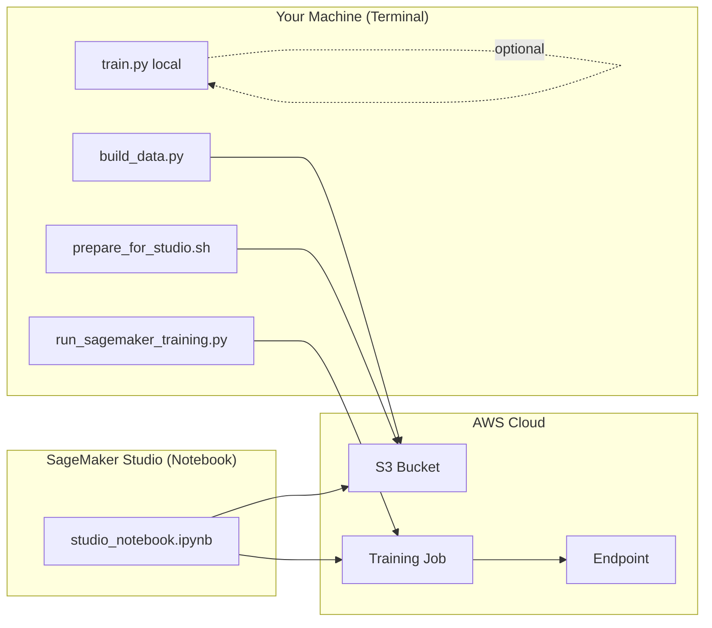

# Slide 3: The Terminal — Your Local Control Panel

## What Is "The Terminal" Here?

The **terminal** (also called the shell or command line) is where you run scripts directly on your machine — no cloud required. In this project, the terminal is how you:

1. Build the dataset
2. Train locally (optional)
3. Upload to S3 before SageMaker
4. Run the FastAPI server for local testing

Think of it as the **developer's remote control** for the pipeline.

---

## Key Terminal Commands

### 1. Build the dataset

```bash
# From project root — needs DISCOGS_USER_TOKEN in backend/.env.local
python backend/scripts/build_data.py --count 500
```

**What happens:** Discogs XML dump → JSONL manifest → enrich with image URLs → download cover images.

### 2. Train locally (optional)

```bash
python backend/scripts/train.py --data-dir data --model-dir backend/models
```

**What happens:** Loads images + manifest, fine-tunes ResNet50, saves `model.pth` and `metadata.json`.

### 3. Prepare for SageMaker (upload to S3)

```bash
./prepare_for_studio.sh your-bucket-name us-east-1
```

**What happens:** Syncs `data/` and packages `backend/` code into a tarball on S3.

### 4. Launch SageMaker training from terminal (alternative to notebook)

```bash
cd backend
python scripts/run_sagemaker_training.py --bucket your-bucket-name
```

**What happens:** Uploads data + code, starts a SageMaker Training Job.

---

## Terminal vs. Notebook vs. SageMaker Console



| Where | Best for |
|-------|----------|
| **Terminal (local)** | Data prep, quick local experiments, CI/scripts |
| **Terminal → SageMaker script** | One-shot cloud training without opening Studio |
| **Studio notebook** | Interactive train → deploy → test in one place |
| **SageMaker Console** | Monitoring jobs, viewing logs, managing endpoints |
