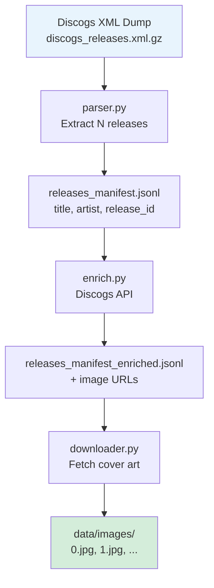

# Slide 4: Data Pipeline — From Discogs to Training Images

## Pipeline Stages



## Manifest Format (JSONL)

One JSON object per line — each line is one **class** the model learns:

```json
{
  "release_id": "12345",
  "title": "Kind of Blue",
  "artists": ["Miles Davis"],
  "labels": ["Columbia"],
  "released": "1959",
  "image_url": "https://..."
}
```

## Entry Point: `build_data.py`

Single CLI that chains all steps:

| Flag | Purpose |
|------|---------|
| `--count 500` | How many releases to include |
| `--skip-download-dump` | Reuse existing XML file |
| `--skip-enrich` | Skip API step (no image URLs) |
| `--skip-download-images` | Parse only, no images |

## Why Enrichment Matters

The XML dump has metadata but **not always direct image URLs**. The enrich step calls the Discogs API to attach cover art links before download.

**Credential:** `DISCOGS_USER_TOKEN` in `backend/.env.local`
