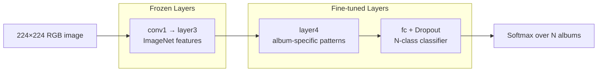

# Slide 5: Model Architecture — ResNet50 + Transfer Learning

## What Is Transfer Learning?

Instead of training a neural network from scratch (millions of images, weeks of GPU time), we:

1. Start with **ResNet50** pre-trained on **ImageNet** (1,000 general object classes)
2. **Freeze** early layers (edges, textures, shapes — already useful)
3. **Replace the final layer** for our N album classes
4. **Fine-tune** only the last block + classifier head

## Code: `backend/ml/model.py`

| Design choice | Value | Why |
|---------------|-------|-----|
| Base model | ResNet50 | Strong image features, well-supported |
| Pretrained weights | ImageNet | Faster convergence, better accuracy |
| Dropout | 0.4 | Reduces overfitting on small datasets |
| Output | N classes | One class per release in manifest |

## Input / Output

| | Detail |
|---|--------|
| **Input** | 224×224 RGB, normalized (ImageNet mean/std) |
| **Output** | Logits → softmax → top-5 predictions with confidence |
| **Artifacts saved** | `model.pth` (weights) + `metadata.json` (class labels, accuracy) |

## Dataset: `backend/ml/dataset.py`

- **Train/val split:** 80/20 with stratification when possible
- **Augmentation (train only):** random crop, horizontal flip, color jitter
- **Multi-image support:** `{idx}_0.jpg`, `{idx}_1.jpg` for multiple photos per album

---

## Analogy: The Art History Student (Layers)

Imagine teaching someone to recognize **your album collection**, not every image in the world.

| Layer in ResNet50 | Analogy | In our model |
|-------------------|---------|--------------|
| **Early layers** (conv1 → layer3) | Basic vision: edges, colors, shapes — “this is a square with text” | **Frozen** — already learned from ImageNet, like a student who already passed Art 101 |
| **layer4** | Style-specific patterns: “typical record-cover layout, band photo vs abstract art” | **Trainable** — adapting general vision to *album covers* |
| **fc (classifier head)** | Index cards for each album: “this look = Kind of Blue, that look = Abbey Road” | **Trainable** — learns your exact catalog |

The network doesn’t relearn “what is a circle” every run. It reuses cheap, general skills and only retrains the **album specialist** at the top.

> **One-liner:** Bottom layers = general eyes (frozen). Top layers = album expert (trained).
