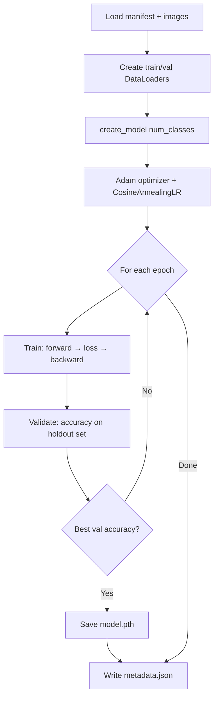

# Slide 6: Training Process — What Happens During a Run

## Training Loop (`backend/ml/train.py`)



## Hyperparameters

| Parameter | Default | SageMaker flag |
|-----------|---------|----------------|
| Epochs | 25 | `--epochs` / `epochs` |
| Batch size | 16 | `--batch-size` / `batch-size` |
| Learning rate | 0.001 | `--learning-rate` |
| Weight decay | 1e-4 | — |
| Val split | 20% | `--test-size` |

## SageMaker Environment Variables

When SageMaker runs `train.py`, it sets paths automatically:

| Variable | Meaning |
|----------|---------|
| `SM_CHANNEL_TRAINING` | Path to downloaded S3 data (manifest + images) |
| `SM_MODEL_DIR` | Where to write model artifacts (uploaded to S3 after job) |

Same script, zero code changes — local uses `--data-dir` and `--model-dir` instead.

## What Gets Saved

```
models/
├── model.pth        # Best checkpoint (state_dict)
└── metadata.json    # num_classes, releases list, best_val_accuracy
```

SageMaker bundles these into `model.tar.gz` and stores at `s3://bucket/models/<job-name>/output/`.

## Typical Metrics

- **50 albums, 10 epochs, CPU:** ~10–30 min on SageMaker `ml.m5.xlarge`
- **Validation accuracy:** varies with dataset size (often 60–90% for small catalogs)

---

## Analogy: The Art History Student (Epochs)

*(Pairs with the layer analogy on slide 5.)*

### One epoch = one full pass through the flashcard deck

One **epoch** means the model sees **every training image once** (in batches of 16). Think of a study session:

1. **Shuffle the deck** (`shuffle=True`) — order changes each epoch so it doesn’t memorize sequence
2. **Show a batch of 16 covers** — “What album is this?”
3. **Guess** (forward pass through all layers)
4. **Check the answer** (loss = how wrong the guess was)
5. **Adjust only the trainable parts** (backward pass + optimizer) — mainly layer4 + fc
6. Repeat until every training image has been seen once → **one epoch done**

### Train vs validation = practice vs quiz

| Phase | Analogy | What happens |
|-------|---------|--------------|
| **Training** | Practice with the answer key visible | Model updates its weights |
| **Validation** | Closed-book quiz on held-out photos | No updates — just “how well are we doing?” |

If validation accuracy improves, save `model.pth` — keep the best version of the student before they start **overfitting** (memorizing training photos instead of learning the albums).

### Multiple epochs = studying many nights

| Epoch | What it feels like |
|-------|-------------------|
| **1** | Lots of mistakes; rough associations |
| **~5** | Starts recognizing common layouts and artists |
| **10+** | Diminishing returns; risk of memorizing training set |

The **cosine learning rate scheduler** is like turning down how big each correction gets: early epochs = bold adjustments, later epochs = fine polishing.

> **One-liner:** An epoch is one full lap through every training cover — guess, grade, adjust — then a validation quiz.
