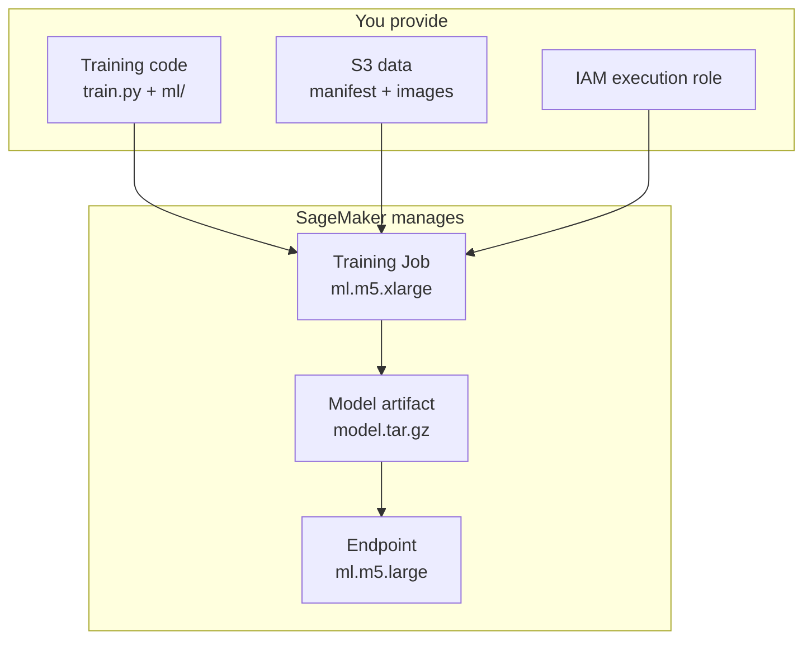

# Slide 7: What Is Amazon SageMaker?

## Plain-English Definition

**Amazon SageMaker** is AWS's managed machine learning platform. Instead of provisioning your own GPU server, installing PyTorch, copying data, and babysitting training, SageMaker:

- Spins up the right **compute instance** on demand
- Mounts your **data from S3**
- Runs your **training script** in a pre-built PyTorch container
- Saves **model artifacts** back to S3
- Can **deploy** the model as a live HTTP **endpoint**

You pay **per hour** while instances run — then shut them down.

---

## Core SageMaker Concepts

| Concept | What it is |
|---------|------------|
| **SageMaker Studio** | Web IDE with Jupyter notebooks + file browser |
| **Training Job** | One run of your training script on cloud hardware |
| **Estimator** | Python SDK object (`PyTorch(...)`) that launches jobs |
| **Model artifact** | `model.tar.gz` — weights + metadata from training |
| **Endpoint** | Always-on server that accepts prediction requests |
| **Execution role** | IAM role SageMaker assumes to read/write S3 |

---

## Why We Use SageMaker for This Project

| Benefit | Explanation |
|---------|-------------|
| **No local GPU needed** | Train on `ml.m5.xlarge` (CPU) or `ml.p3.2xlarge` (GPU) |
| **Reproducible** | Same container image every run |
| **Scalable data** | S3 holds large image sets; instance downloads what it needs |
| **One-click deploy** | `model.deploy()` → live inference API |
| **Integrated with AWS** | Lambda, API Gateway, CDK stacks in `infrastructure/` |

---

## SageMaker vs. Local Training

| | Local (`scripts/train.py`) | SageMaker (`estimator.fit()`) |
|---|---------------------------|-------------------------------|
| Hardware | Your laptop CPU/GPU | AWS instance you choose |
| Data location | `data/` folder | `s3://bucket/data/` |
| Output | `backend/models/` | `s3://bucket/models/` |
| Best for | Quick experiments | Production-scale, deployable artifacts |
| Cost | Free (your machine) | ~$0.23/hr (ml.m5.xlarge) |
