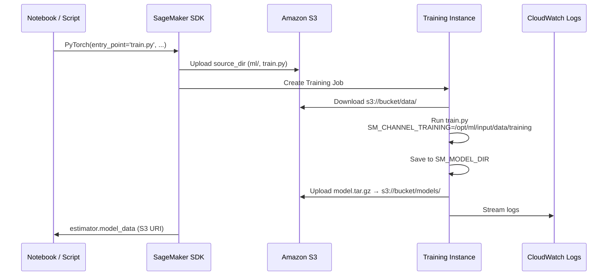

# Slide 8: SageMaker Training — Step by Step

## What Happens When You Call `estimator.fit()`



## Our Training Configuration

From `studio_notebook.ipynb` and `run_sagemaker_training.py`:

```python
estimator = PyTorch(
    entry_point='train.py',           # backend/train.py → ml.train
    source_dir=BACKEND_DIR,           # packages ml/, data/, train.py
    role=role,                        # auto-detected in Studio
    instance_type='ml.m5.xlarge',     # CPU, ~$0.23/hr
    framework_version='2.4.0',
    py_version='py311',
    hyperparameters={
        'epochs': '10',
        'batch-size': '16',
    },
    output_path=f's3://{BUCKET_NAME}/models/',
)
estimator.fit({'training': f's3://{BUCKET_NAME}/data/'})
```

## S3 Layout After Upload

```
s3://your-bucket/
├── data/
│   ├── releases_manifest_enriched.jsonl
│   └── images/
│       ├── 0.jpg
│       ├── 1.jpg
│       └── ...
├── code/
│   └── sourcedir.tar.gz          ← ml/, data/, train.py, inference.py
└── models/                       ← created by training job
    └── album-classifier-2025-06-15-12-00-00/
        └── output/
            └── model.tar.gz      ← model.pth + metadata.json inside
```

## Two Ways to Start Training

| Method | Command / Action |
|--------|------------------|
| **Notebook** | Run training cell in `studio_notebook.ipynb` |
| **Terminal script** | `python backend/scripts/run_sagemaker_training.py --bucket NAME` |
| **Shell prep only** | `./prepare_for_studio.sh BUCKET` then train from notebook |

All three use the same `train.py` entry point and the same S3 structure.
