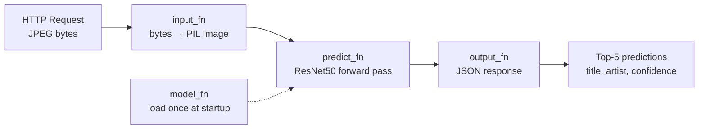

# Slide 9: Inference & Deployment

## SageMaker Inference Handlers

SageMaker expects four functions in `backend/ml/inference.py` (re-exported by `backend/inference.py`):



| Function | Role |
|----------|------|
| `model_fn(model_dir)` | Load `model.pth` + `metadata.json` when endpoint starts |
| `input_fn(body, content_type)` | Parse JPEG/PNG or base64 JSON → PIL Image |
| `predict_fn(image, bundle)` | Preprocess, run model, return top-5 with release metadata |
| `output_fn(predictions, accept)` | Serialize to JSON |

## Deploying an Endpoint

```python
model = PyTorchModel(
    model_data=estimator.model_data,   # S3 path from training
    entry_point='inference.py',
    framework_version='2.3.0',         # inference image (differs from training)
    source_dir=BACKEND_DIR,
    role=role,
)

predictor = model.deploy(
    instance_type='ml.m5.large',
    endpoint_name='album-classifier',
)
```

## Testing a Prediction

```python
with open('test_image.jpg', 'rb') as f:
    response = predictor.predict(
        f.read(),
        initial_args={'ContentType': 'image/jpeg'}
    )
# → {"success": true, "predictions": [{title, artists, confidence, ...}, ...]}
```

## Full Serving Stack (Optional)


See `infrastructure/lib/inference-stack.ts` and `docs/DEPLOY_INFERENCE.md` for CDK deployment.

## Cost Reminder

Endpoints bill **continuously** while running (~$0.11/hr for `ml.m5.large`). Delete when not demoing:

```python
predictor.delete_endpoint()
predictor.delete_model()
```
