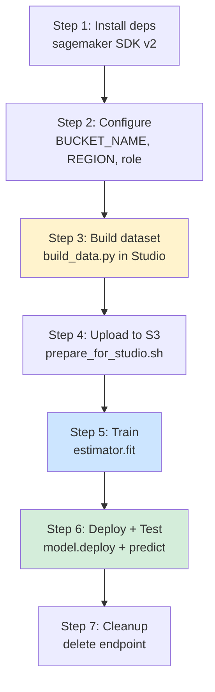

# Slide 10: The Studio Notebook — How It All Connects

## What Is `studio_notebook.ipynb`?

A **Jupyter notebook** that runs inside **SageMaker Studio**. It is the interactive "mission control" for the full cloud workflow — from building data to testing live predictions.

You run cells **top to bottom**. Each step depends on the previous one.

---

## Notebook Steps (6 Phases)



| Step | What the cell does | Terminal equivalent |
|------|-------------------|---------------------|
| **1. Install** | Pins `sagemaker==2.232.2` (Studio ships v3 by default) | `pip install sagemaker` |
| **2. Configure** | Sets bucket, region, detects IAM role | — |
| **3. Build data** | Writes `.env.local`, runs `build_data.py --count 50` | Same command locally |
| **4. Upload** | Runs `prepare_for_studio.sh BUCKET REGION` | Same shell script |
| **5. Train** | Creates `PyTorch` estimator, calls `fit()` | `run_sagemaker_training.py` |
| **6. Deploy** | `PyTorchModel.deploy()` → test with JPEG | — |
| **7. Cleanup** | Optional endpoint deletion | — |

---

## Why Run `build_data` Inside Studio?

Studio has:

- Network access to Discogs API and XML dumps
- The repo cloned at `/home/sagemaker-user/discogs-sagemaker`
- The same Python environment as your local backend

So the notebook can **build data in the cloud** without uploading gigabytes from your laptop.

---

## Key Configuration in the Notebook

```python
BUCKET_NAME = 'your-bucket-name'      # ← must update
REGION = 'us-east-2'
REPO_DIR = '/home/sagemaker-user/discogs-sagemaker'
BACKEND_DIR = f'{REPO_DIR}/backend'

PYTORCH_TRAIN_VERSION = '2.4.0'       # training container
PYTORCH_INFER_VERSION = '2.3.0'       # inference container (SDK image map)
```

**Note:** Training and inference use **different PyTorch versions** because the SageMaker SDK maps supported images separately for each.

---

## Notebook vs. Terminal Script

| | `studio_notebook.ipynb` | `run_sagemaker_training.py` |
|---|-------------------------|-------------------------------|
| Data build | ✅ Built-in cells | ❌ Assumes data already exists |
| Upload | ✅ Via `prepare_for_studio.sh` | ✅ Built into script |
| Train | ✅ | ✅ |
| Deploy | ✅ | ❌ (prints instructions) |
| Test endpoint | ✅ | ❌ |
| Best for | Demos, learning, full pipeline | Automation, CI, quick retrain |
