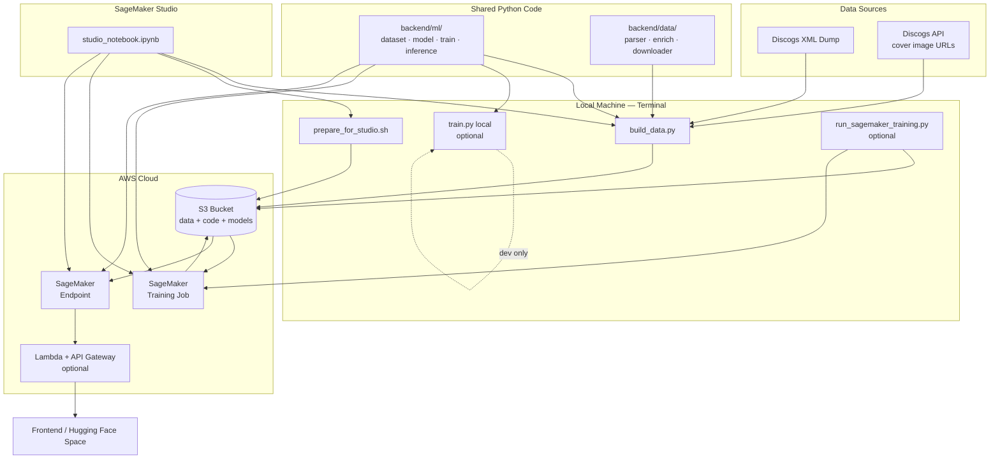
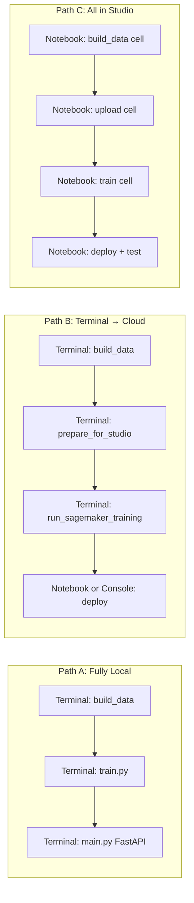

# Slide 11: End-to-End — How Everything Works Together

## The Complete System

---

## Three Entry Paths, One Codebase

---

## File → Responsibility Map

| File / Folder | Responsibility |
|---------------|----------------|
| `backend/scripts/build_data.py` | CLI: full data pipeline |
| `backend/ml/model.py` | ResNet50 architecture |
| `backend/ml/dataset.py` | Load manifest, augment images |
| `backend/ml/train.py` | Training loop (local + SageMaker) |
| `backend/ml/inference.py` | SageMaker inference handlers |
| `backend/train.py` | Thin SageMaker entry → `ml.train` |
| `backend/inference.py` | Thin SageMaker entry → `ml.inference` |
| `prepare_for_studio.sh` | Package + upload to S3 |
| `run_sagemaker_training.py` | Upload + launch training job |
| `notebooks/studio_notebook.ipynb` | Interactive full pipeline |
| `infrastructure/` | CDK: Lambda, API Gateway, stacks |

---

## Data Flow Summary

1. **Discogs** → manifest JSONL + JPEG images
2. **S3** → durable storage for cloud training
3. **Training Job** → reads S3, writes `model.tar.gz`
4. **Endpoint** → loads model, serves predictions
5. **Frontend** → sends album photo, displays top matches
